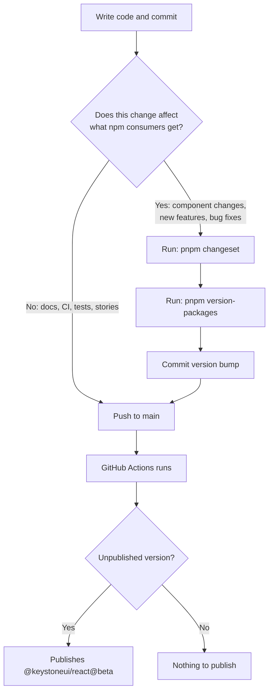

# Contributing to Keystone UI

This guide covers the end-to-end workflow for adding and maintaining components in Keystone UI.

## Quick Reference

| What | Where |
|------|-------|
| Component source | `packages/ui/src/{name}.tsx` |
| Package exports | `packages/ui/package.json` |
| Build entry points | `packages/ui/tsup.config.ts` |
| Registry metadata | `packages/ui/src/_registry.ts` |
| Storybook stories | `apps/storybook/stories/{name}.stories.tsx` |
| Fumadocs demos | `apps/docs/demos/{name}/` |
| Demo registry | `apps/docs/demos/index.ts` |
| MDX documentation | `apps/docs/content/docs/components/{name}.mdx` |
| Component navigation | `apps/docs/content/docs/components/meta.json` |

## Adding a New Component

### 1. Scaffold

Run the scaffolding command from the workspace root:

```bash
pnpm add:component MyComponent
```

This creates all files and updates all registries automatically:

- `packages/ui/src/my-component.tsx` — component template
- `packages/ui/package.json` — subpath export
- `packages/ui/tsup.config.ts` — build entry
- `packages/ui/src/_registry.ts` — shadcn registry entry
- `apps/storybook/stories/my-component.stories.tsx` — story template
- `apps/docs/demos/my-component/default.tsx` — default demo
- `apps/docs/demos/index.ts` — demo registry entry
- `apps/docs/content/docs/components/my-component.mdx` — documentation page
- `apps/docs/content/docs/components/meta.json` — navigation entry

### 2. Implement the component

Edit `packages/ui/src/my-component.tsx`. Follow the conventions in `.cursor/rules/component-architecture.mdc` and `.cursor/rules/design-tokens.mdc`.

Key rules:
- Single-file component (types, contexts, sub-components all in one file)
- Use `@base-ui/react` for primitives (never Radix UI)
- Use `class-variance-authority` for variants
- Add `data-slot` to every exported component part
- Use React 19 ref props (no `forwardRef`)

### 3. Write Storybook stories (primary development surface)

Edit `apps/storybook/stories/my-component.stories.tsx`. This is where you develop and iterate on the component visually.

Write comprehensive stories covering:
- All variants and sizes
- Interactive states (hover, focus, disabled, loading)
- Composition patterns
- Edge cases

Run Storybook: `pnpm dev --filter=storybook`

### 4. Create Fumadocs demos

Create simplified demos in `apps/docs/demos/my-component/`. Not every Storybook story needs a demo — focus on the 3-6 most useful examples.

Each demo file must:
- Start with `"use client";`
- Import from `@keystoneui/react/my-component`
- Export a single default function

Example:

```tsx
"use client";

import { MyComponent } from "@keystoneui/react/my-component";

export default function MyComponentDefault() {
  return <MyComponent>Hello</MyComponent>;
}
```

### 5. Register demos

Add each demo to `apps/docs/demos/index.ts`:

```ts
import MyComponentDefault from "./my-component/default";
import MyComponentVariants from "./my-component/variants";

// In the demos record:
"my-component-default": { component: MyComponentDefault, file: "my-component/default.tsx" },
"my-component-variants": { component: MyComponentVariants, file: "my-component/variants.tsx" },
```

### 6. Write MDX documentation

Edit `apps/docs/content/docs/components/my-component.mdx`:

```mdx
---
title: MyComponent
description: A brief description of the component.
---

## Import

\`\`\`tsx
import { MyComponent } from "@keystoneui/react/my-component";
\`\`\`

## Usage

<ComponentPreview name="my-component-default" />

## Variants

<ComponentPreview name="my-component-variants" />

## API Reference

| Prop | Type | Default | Description |
| --- | --- | --- | --- |
| `variant` | `"default" \| "outline"` | `"default"` | Visual variant |
```

### 7. LLMs.txt (automatic)

No manual step. The LLMs.txt pipeline reads MDX pages and replaces `<ComponentPreview>` tags with actual demo source code. After deployment, the endpoints at `/llms.txt`, `/llms-full.txt`, `/llms-components.txt`, and `/docs/components/my-component.mdx` are updated automatically.

## Updating an Existing Component

### When to update Fumadocs

| Change type | Storybook | Demos | MDX |
|-------------|-----------|-------|-----|
| **New prop or variant** | Add/update story | Add demo if user-facing | Update API Reference table |
| **Prop renamed or removed** | Update stories | Update affected demos | Update API Reference table |
| **New sub-component** | Add stories | Add demo if useful | Add to Import section |
| **Visual/styling change** | Auto-reflects | Auto-reflects | No change needed |
| **Bug fix** | Add regression story | No change needed | No change needed |
| **Description change** | N/A | N/A | Update MDX frontmatter |

### Checklist for API changes

1. Update the component source in `packages/ui/src/{name}.tsx`
2. Update or add Storybook stories
3. If the change is user-facing:
   - Update relevant demos in `apps/docs/demos/{name}/`
   - Add new demos for new features
   - Update the MDX API Reference table
4. If dependencies changed, update `packages/ui/src/_registry.ts`

### Checklist for new sub-components

1. Update the component source
2. Add Storybook stories for the new sub-component
3. Create a demo showing the sub-component in use
4. Register the demo in `apps/docs/demos/index.ts`
5. Update the MDX Import section and add a `<ComponentPreview>` for the new demo

## Development Commands

```bash
pnpm dev --filter=storybook    # Storybook dev server (port 6006)
pnpm dev --filter=docs          # Fumadocs dev server (port 3000)
pnpm build --filter=docs        # Build docs (verifies types + LLMs.txt)
pnpm add:component <Name>       # Scaffold a new component
```

## Release Workflow

The library uses [Changesets](https://github.com/changesets/changesets) in **pre-release mode** to publish beta versions to npm. The package is published as `@keystoneui/react` and consumers install with `pnpm add @keystoneui/react@beta`.

### How it works



### When you need a changeset

Create a changeset for any change that affects what consumers of `@keystoneui/react` receive:

- New component added
- Bug fix in a component
- Changed API, props, or behavior
- Styling changes that affect consumers
- Updated dependencies in `packages/ui/package.json`

### When you do NOT need a changeset

Skip the changeset for anything internal to the repo:

- Storybook stories
- CI workflow changes
- Documentation (docs app, README)
- Test additions or fixes
- Dev tooling changes

Commits without a changeset push to GitHub but do not trigger an npm publish. The `@beta` tag on npm stays at the previous version until you explicitly publish.

### Publishing a new beta version

```bash
# 1. Create a changeset (select @keystoneui/react, pick bump type, write summary)
pnpm changeset

# 2. Apply the version bump (increments beta counter)
pnpm version-packages

# 3. Commit the version bump
git add .
git commit -m "chore: version packages"

# 4. Push to main (GitHub Actions publishes to npm automatically)
git push origin main
```

### Version progression

In pre-release mode, each publish increments the beta counter regardless of bump type:

| Cycle | Version |
|-------|---------|
| Initial | `0.1.0-beta.0` |
| After 1st changeset | `0.1.0-beta.1` |
| After 2nd changeset | `0.1.0-beta.2` |

The bump type (patch, minor, major) is remembered by changesets and applied when you exit beta.

### Batching changes

You do not need a changeset for every commit. Multiple commits can be batched into a single publish:

```
commit: fix button focus ring         # no changeset yet
commit: add new Kbd component          # no changeset yet
commit: fix select portal issue        # no changeset yet
pnpm changeset                         # describe all changes at once
pnpm version-packages                  # bumps to next beta
commit + push                          # publishes everything in one version
```

### Exiting beta (stable release)

When the library is ready for a stable `1.0.0` (or `0.1.0`) release:

```bash
pnpm changeset pre exit     # exit pre-release mode
pnpm changeset              # create a changeset for the stable release
pnpm version-packages       # bumps to stable version (e.g. 0.1.0)
git add . && git commit -m "chore: release stable version"
git push origin main        # publishes to @latest tag
```

After this, `pnpm add @keystoneui/react` (without `@beta`) installs the stable version.

## LLMs.txt Endpoints

These are generated automatically from MDX + demo files:

| URL | Description |
|-----|-------------|
| `/llms.txt` | Index of all documentation pages |
| `/llms-full.txt` | Complete documentation content |
| `/llms-components.txt` | Component documentation only |
| `/docs/components/{name}.mdx` | Individual component page |

The pipeline replaces `<ComponentPreview name="X" />` tags with actual demo source code from disk, so AI agents receive real, executable code examples.
